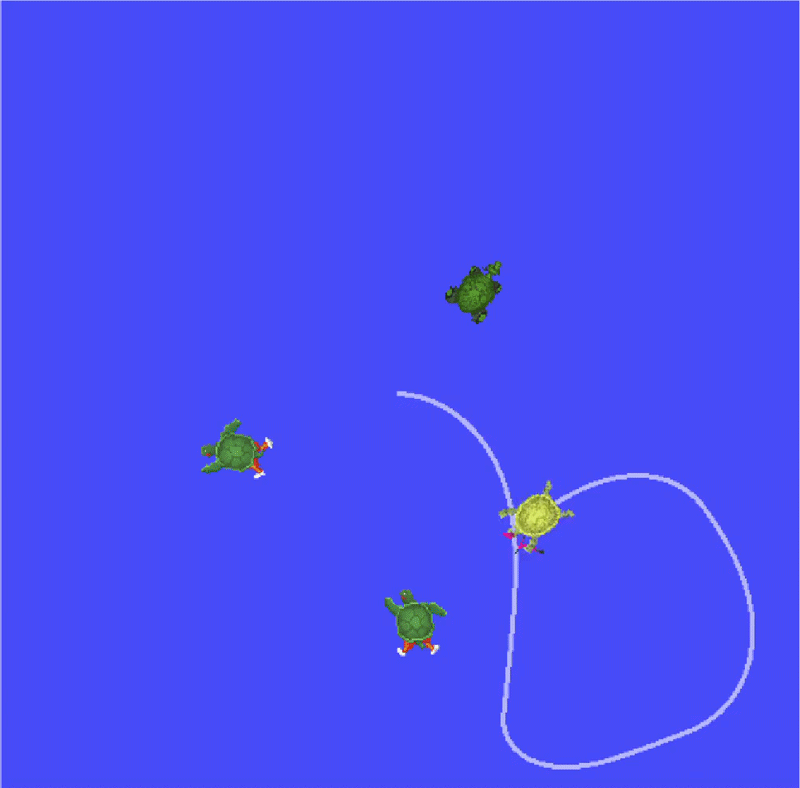
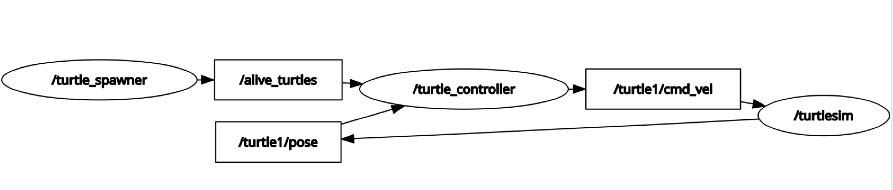

# ROS2 Turtlesim: Catch Them All (C++)

A multi-node ROS2 system in C++ where a master turtle autonomously 
hunts and catches randomly spawned turtles using a proportional controller.

Developed as the final project of a ROS2 Udemy course (C++ implementation).



## System Architecture

Three nodes communicating via topics and services:

- `turtle_spawner` — spawns turtles at configurable rate, manages alive list
- `turtle_controller` — P controller to chase and catch target turtles  
- `turtlesim_node` — built-in ROS2 simulator



## Key Implementation Details
- Proportional controller with angle wrapping for smooth pursuit
- Closest-turtle selection via runtime parameter
- Fully async service calls (non-blocking)
- Custom interfaces: `Turtle.msg`, `TurtleArray.msg`, `CatchTurtle.srv`
- Configurable via YAML parameter file

## Parameters
| Node | Parameter | Default |
|------|-----------|---------|
| turtle_controller | catch_closest_turtle_first | true |
| turtle_spawner | spawn_frequency | 1.7 Hz |
| turtle_spawner | turtle_name_prefix | "New_turtle" |

## How to Run
```bash
ros2 launch my_robot_bringup turtlesim_catch_them_all.launch.xml
```

## Planned Extension
Dynamic target tracking — moving turtles with dynamic subscriber 
management and predictive pursuit control.

## Environment
- ROS2 Jazzy
- Ubuntu 24.04
- C++17
  
[Udemy Certificate](certificate.pdf)
